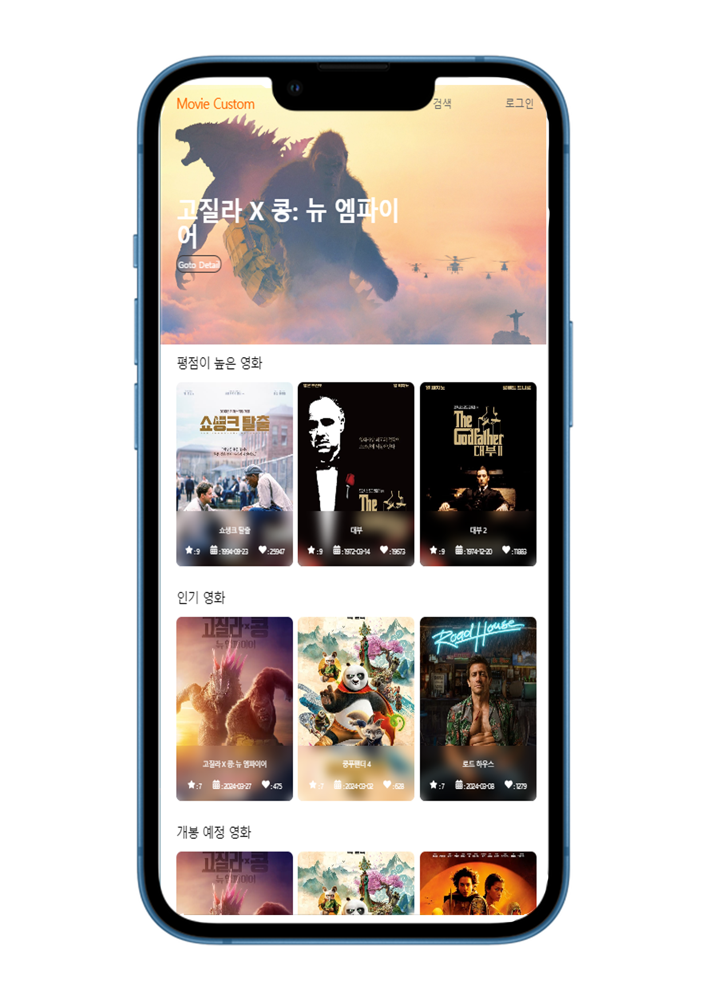
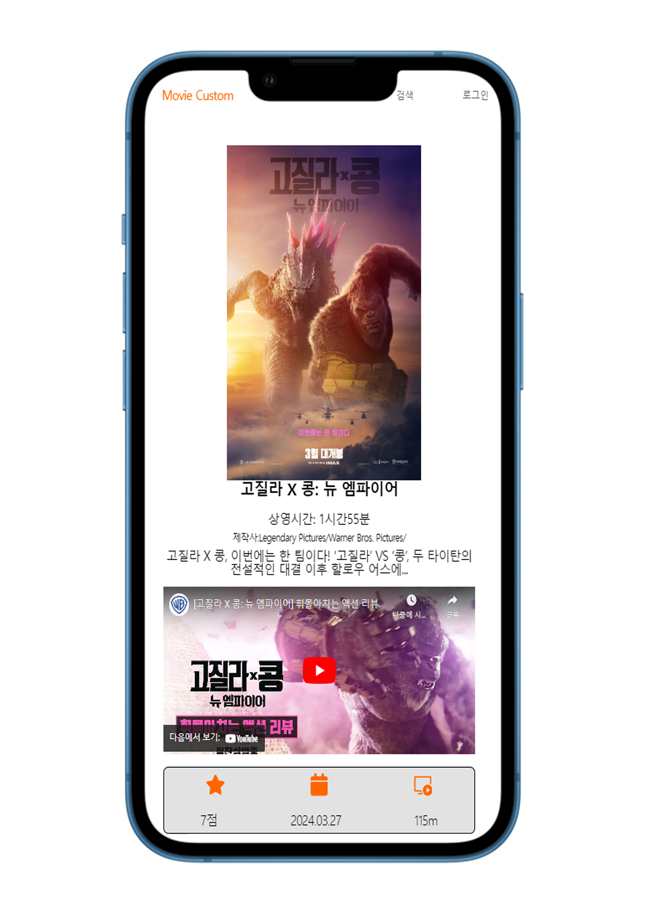

# MOVIE-CUSTOM

## 개발완료일자 : 2024-04-08

## ScreenShot

# 로고

  
  
MOVIE_CUSTOM

### 홈화면

---

  

### 상세화면

---

  

### 검색화면

---

  

# 개발기간

## 2024-03-25 ~ 2024-04-08

# Stack

<!--  -->

# 프로젝트 목적

사용자에게 영화정보를 쉽게 전달하기 위해 만들었습니다.사용자가 접근 하는 모든 디바이스에 대하여 최적의 환경을 제공하기 위해 제작 되었습니다.

# 프로젝트 기획

# 프로젝트 소개

1. 반응형 웹페이지
   - 모든 디바이스에서의 호환을 위해 반응형 웹페이지를 제작해 해상도에 따라 요소가 다르게 보이도록 했습니다.
2. 홈페이지
   - 메인배너에서 현재상영중인 영화들을 보여주기위해 Swiper를 이용하여 자동으로 슬라이딩 되도록 하였습니다.
   - 평점이 높은 영화,상영 예정인 영화들을 Swiper를 통해 나열했습니다.
3. 검색 페이지
   - 검색 바의 입력을 통해 사용자가 원하는 데이터를 Swiper를 통해 쉽게 볼 수 있습니다.
   - 더 많은 검색 데이터를 위해 Pagination을 적용했습니다.
4. 상세 페이지
   - 영상을 통해 영화의 전반적인 내용을 확인 할 수 있습니다.
   - 제목,러닝타임,제작사등을 한페이지에 확인 할 수 있도록 구성했습니다.
5. 로그인 페이지
   - 로그인에 필요한 아이디와 비밀번호는 일정한 규칙에 맞게 입력되어야 하며 그렇지 않을시 부족한 부분을 표기했습니다.
   - 로그인에 대한 규칙이 올바르면 쿠키에 기록되며
     헤더에서 로그인 여부를 확인 할 수 있습니다.

# 프로젝트 URL

https://wjdaudrb7410.github.io/movie-custom/

# 프로젝트 진행중 느낀점

API에 있는 데이터와 기능들을 구현하는것은 수월하였으나 고급기능을 이용하는데 있어서 부족한 데이터를 내가 필요한 용도로 가공하는데 어려움을 느꼈습니다.하지만 웹서핑을 통한 자료를 수집하고 통합하면서 제가 원하는 기능을 구현할수 있었습니다.

그리고 디자인 작업을 하는 도중에 내가 원하는 모양이 나오지 않는것과 페이지 크기가 모니터로 보는것과 실제 크기가 다소 맞지 않아 생기는 이질감 때문에 작업이 더뎌젔습니다.하지만 크롬에서 제공하는 해상도 고정 기능을 이용해 반응형 제작을 하였고 휴대폰으로도 접속해 내가 만든것과 실제 배포된 페이지의 차이를 확인할 수 있었습니다.
